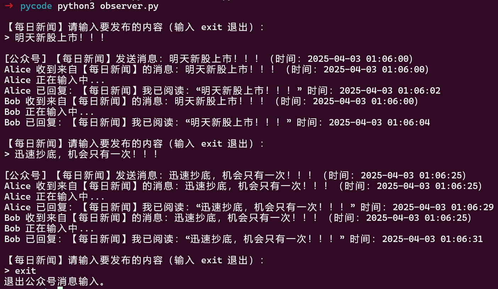

# 设计模式——观察者模式

## 1.模仿微信公众号  ———公众号发出消息 订阅者随之接手并改变

如果一个对象的状态发生改变，某些与它相关的对象也要随之做出相应的变化


​                                                                       图片来源:     [掘金–观察者模式](https://juejin.cn/post/6844904100459446285)

eg: 微信公众号 在使用微信公众号时，当你关注的公众号中有新内容更新的话，它就会推送给关注公众号的微信用户端。我们使用观察者模式来模拟这样的场景，微信用户就是观察者，微信公众号是被观察者，有多个的微信用户关注了程序猿这个公众号


```python
#库文件
from datetime import datetime 
from abc import ABC ,abstractmethod #抽象方法装饰器
import time
import random
import sys
```


## 2.抽象接口

```python
# 抽象观察者接口
class Observer(ABC):
    @abstractmethod
    def update(self, SendName, message, timestamp):
        pass    #不实现内容#;在 c++ 中为 虚函数 virtual
# 抽象被观察者接口
class Observable(ABC):
    @abstractmethod
    def add_user(self, observer):
        pass

    @abstractmethod
    def move_user(self, observer):
        pass

    @abstractmethod
    def notify(self, message):#通知抽象方法
        pass
```
##  3.用户类

```python
# 用户类，实现 Observer 接口
class User(Observer):
    def __init__(self, name):
        self.name = name
        
    # 当被观察者调用 notify_observers 时，会触发update
    #                公众号名字  信息    时间戳
    def update(self, SendName, message, timestamp):
        print(f"{self.name} 收到来自【{SendName}】的消息：{message}（时间：{timestamp}）")
        self.auto_reply(SendName, message, timestamp)

    def auto_reply(self, SendName, message, timestamp):
        #模拟用户输入
        print(f"{self.name} 正在输入中", end="")
        for _ in range(3):
            time.sleep(0.5)
            print(".", end="")
            sys.stdout.flush()
        print()  # 换行
        time.sleep(random.uniform(0.5, 3)) #假装延迟，模拟思考
        now_time=datetime.now().strftime('%Y-%m-%d %H:%M:%S')
        print(f"{self.name} 已回复：【{SendName}】我已阅读：“{message}” 时间：{now_time}")
```

## 4.公众号类

```python
# 公众号类，实现 Observable 接口
class public_account(Observable):
    def __init__(self, name):
        self.name = name    #          key->value     
        self.all_user = {} #hashmap name->observer

    def add_user(self, observer):
        if observer.name not in self.all_user:
            self.all_user[observer.name]=observer

    def move_user(self, observer):
        if observer.name in self.all_user:
            del self.all_user[observer.name]

    def notify(self, message):
        timestamp = datetime.now().strftime('%Y-%m-%d %H:%M:%S')
        print(f"\n[公众号] 【{self.name}】发送消息：{message}（时间：{timestamp}）")
        for observer in self.all_user.values():
            observer.update(self.name, message, timestamp)

    def input_and_send(self):
        while True:
            msg = input(f"\n【{self.name}】请输入要发布的内容（输入 exit 退出）：\n> ")
            if msg.lower() == "exit":
                print("退出公众号消息输入。")
                break
            self.notify(msg)
```

  ```python
if __name__ == "__main__":
    account = public_account("每日新闻")
    alice = User("Alice")
    bob = User("Bob")
    account.add_user(alice)
    account.add_user(bob)

    account.input_and_send()
  ```

## 5.输出

## 6优缺点


**优点：**

- 降低了目标与观察者之间的耦合关系，两者之间是抽象耦合关系。
- 被观察者发送通知，所有注册的观察者都会收到信息【可以实现广播机制】

**缺点：**

- 如果观察者非常多的话，那么所有的观察者收到被观察者发送的通知会耗时
- 如果被观察者有循环依赖的话，那么被观察者发送通知会使观察者循环调用，会导致系统崩溃

## 7 使用场景


- 对象间存在一对多关系，一个对象的状态发生改变会影响其他对象。

- 当一个抽象模型有两个方面，其中一个方面依赖于另一方面时。

## 8. 目的

### 1.3为什么要使用观察者模式?

观察者模式和信号量、互斥锁等同步原语在解决问题时有一些重要区别。观察者模式主要解决的是对象间的一种松散耦合关系，而信号量和互斥锁主要用于解决多线程间的同步和互斥问题。

观察者模式的优势：

1. 松散耦合：观察者模式允许您构建松散耦合的类关系。被观察者和观察者之间并不直接相互依赖，只需关注其接口，而不关心具体实现。这种关系使得组件之间的改变和扩展变得更加容易。
2. 可扩展性：您可以根据需要向系统添加新的观察者，而无需对被观察者做任何修改。同样，可以方便地移除或替换观察者。
3. 支持广播：被观察者可以同时通知多个观察者，当状态发生变化时，所有关注这个状态的观察者都会收到通知。

信号量和互斥锁的优势：

1. 线程同步：信号量和互斥锁的主要目的是控制多线程访问共享资源的同步。它们保证了资源访问的互斥性和同步性，避免了多线程下的竞争条件和死锁。
2. 易于理解：信号量和互斥锁的概念相对简单，容易理解，使用也较为直接。

## 9. 参考:

[C++观察者模式探索：从设计到应用]( https://developer.aliyun.com/article/1463792 )

[python设计模式之观察者模式](https://www.cnblogs.com/lifei01/p/13214597.html)

## 10. 代码地址:
https://github.com/Huah-Yin/Observer-Subject.git
